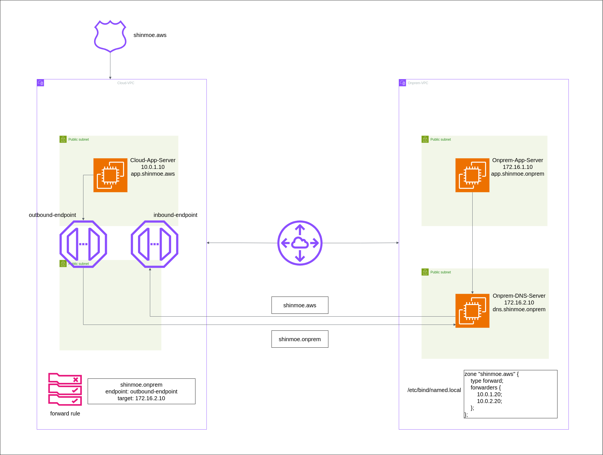

# Hybrid DNS Resolution with Amazon Route 53 Resolver

## Introduction

This handson demonstrates a hybrid DNS architecture using Amazon Route 53 Resolver, connecting an on-premises environment (simulated in AWS) with a cloud VPC. It showcases how to enable seamless DNS resolution between on-premises and cloud environments.

## Scenario

Imagine a company, "shinmoe corp," that has an existing on-premises data center and is in the process of adopting a hybrid cloud strategy with AWS. They want to maintain their existing on-premises DNS infrastructure while also leveraging AWS services. The challenge is to ensure smooth DNS resolution between their on-premises applications and newly deployed cloud resources.

Key requirements:
- Maintain existing on-premises DNS for "shinmoe.onprem" domain
- Set up cloud resources under "shinmoe.aws" domain
- Enable bi-directional DNS resolution between on-premises and cloud environments
- Ensure secure and efficient communication between the two environments

## Architecture Overview



The setup consists of two VPCs:
1. Cloud VPC (10.0.0.0/16)
2. On-premises VPC (172.16.0.0/16)

Key components:
- On-premises DNS server (BIND) running on an EC2 instance
- Route 53 private hosted zone for the cloud environment
- Route 53 Resolver endpoints (inbound-endpoint and outbound-endpoint)
- VPC Peering connection between Cloud and On-premises VPCs
- Custom DHCP Options Set for the on-premises VPC

## Post-Deployment Steps

After successfully applying the Terraform configuration, follow these steps to complete the setup:

**Reboot On-premises VPC Instances**
The custom DHCP options set for the on-premises VPC requires a reboot of the EC2 instances to take effect. This step is crucial for proper DNS resolution within the on-premises environment.

a. Connect to the AWS Management Console

b. Navigate to the EC2 dashboard

c. Select the instances in the on-premises VPC (Onprem-App-Server and Onprem-DNS-Server)

d. Choose "Instance state" > "Reboot instance"

e. Wait for the instances to fully restart (usually takes a few minutes)

## Testing

Follow these steps to verify that your hybrid DNS setup is functioning correctly:

1. **Test On-premises to Cloud DNS Resolution**
   
   a. SSH into the On-premises App server:
      ```bash
      ssh -i hybrid-dns-key.pem ec2-user@<onprem_app_public_ip>
      ```
   b. Resolve the cloud application's domain:
      ```bash
      nslookup app.shinmoe.aws
      ```
   c. Verify that it resolves to the Cloud App's private IP (10.0.1.10)

2. **Test Cloud to On-premises DNS Resolution**
   
   a. SSH into the Cloud App server:
      ```bash
      ssh -i hybrid-dns-key.pem ec2-user@<cloud_app_public_ip>
      ```
   b. Resolve the on-premises application's domain:
      ```bash
      nslookup app.shinmoe.onprem
      ```
   c. Verify that it resolves to the On-premises App's private IP (172.16.1.10)

3. **Test Connectivity Between Cloud and On-premises**
   
   a. From the Cloud App server, ping the On-premises App:
      ```bash
      ping 172.16.1.10
      ```
   b. From the On-premises App server, ping the Cloud App:
      ```bash
      ping 10.0.1.10
      ```

4. **Verify Route 53 Resolver Endpoints**
   
   a. Open the AWS Management Console
   
   b. Navigate to Route 53 > Resolver
   
   c. Check that both inbound and outbound endpoints are in an "Operational" state
   
   d. Review the "Metrics" tab for each endpoint to confirm query processing

5. **Test External DNS Resolution**
   From both Cloud and On-premises App servers, resolve a public domain:
   ```bash
   nslookup www.example.com
   ```

## Observations and Learnings

- The use of static IP addresses simplifies the configuration but may limit scalability
- VPC Peering provides a simple and effective way to connect two VPCs
- Route 53 Resolver greatly simplifies hybrid DNS setups
- Security groups need careful configuration to balance security and functionality
- BIND configuration requires attention to detail, especially in forwarding rules

## Future Improvements

- Implement dynamic IP assignment for EC2 instances
- Add more robust error handling and logging
- Explore using AWS Transit Gateway for more complex network topologies
- Implement DNS security extensions (DNSSEC)
- Set up monitoring and alerting for DNS-related metrics

## Conclusion

This hands-on demonstrates the power of AWS networking and DNS services in creating a hybrid architecture. It showcases how traditional on-premises DNS can be seamlessly integrated with cloud resources, enabling organizations to maintain existing infrastructure while leveraging the benefits of cloud computing.

The combination of VPC Peering, Route 53 Resolver, and a simulated on-premises DNS server provides a realistic scenario for hybrid cloud adoption. This setup can serve as a foundation for [more complex hybrid architectures](https://d1.awsstatic.com/architecture-diagrams/ArchitectureDiagrams/hybrid-dns_route53-resolver-endpoint-ra.pdf?ntwd_hyb9) and can be adapted to various business needs.
